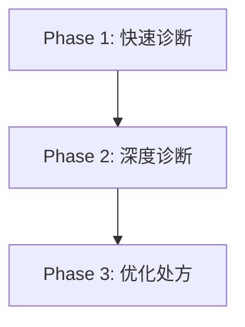

# Portfolio Health Check

## 结构图

## 简介

Portfolio Health Check 是一套面向投资者的持仓体检与优化辅助能力。

它的目标不是直接给出一句“买什么、卖什么”，而是把组合分析拆成更容易理解的几个阶段：先把持仓整理清楚，再判断风险和结构问题，最后在现实约束下给出更合理的优化方向。

从用户视角看，它是一条三阶段流程；从系统视角看，它会先做持仓识别与确认，再调用深度诊断服务生成结构化结果，最后把诊断结果与您的投资约束结合起来形成建议。

---

## 它能为您做什么

这套能力主要提供三类服务：

### 1. 快速整理当前持仓

如果您给的是自然语言、零散列表，甚至只说了股票名称，系统会先尽量帮您整理成结构化组合。

这一阶段重点解决的是：

- 现在到底持有哪些标的
- 每个标的大致占比是多少
- 现金是否已经单独列出来
- 组合是不是一眼就存在明显集中问题

也就是说，它先帮您把“说出来的组合”变成“可以分析的组合”。

---

### 2. 深入分析风险和结构问题

当持仓确认完成后，系统会进一步收集换仓频率、风险承受能力、投资期限等参数，再做更细的组合诊断。

这一阶段更关注：

- 风险来自哪里
- 当前结构是否和您的投资习惯相匹配
- 持仓之间有没有重叠、集中或风格偏移
- 哪些问题是最值得优先关注的

如果条件满足，这一步还可以生成更适合阅读或归档的深度诊断结果。

需要说明的是，当持仓股票较多时，这一步可能会比较慢，等待 10 分钟甚至更久都可能是正常情况。

---

### 3. 在现实约束下生成优化建议

在完成诊断之后，系统不会直接假设您什么都能买、什么都能做，而是会继续问清楚现实边界。

例如：

- 您可投资哪些市场
- 您能使用哪些工具
- 还有多少可追加资金
- 您更看重增长、现金流还是风险对冲

这样做的目的是让建议更接近真实可执行，而不是只停留在“理论上更优”。

---

## 使用方式

您通常可以这样使用它：

### 开始分析

先把当前持仓告诉系统，格式不必太严格。

例如：

- 我现在持有茅台、宁德时代、沪深 300 ETF
- 茅台大概 30%，宁德时代 20%，剩下是 ETF 和现金

---

### 确认持仓

系统整理后，会给出一份确认表。

您只需要确认：

- 股票识别是否正确
- 占比是否大致正确
- 是否漏掉了现金或其他标的

---

### 继续深度诊断

如果您想看更细的分析，系统会继续问几个参数问题。

这部分主要用于让诊断结果更贴近您的实际投资方式，而不是只按“平均投资者”来判断。

---

### 获取优化建议

如果您希望继续往下走，系统会再收集市场、工具、追加资金和投资目标等约束，再给出更有现实意义的优化建议。

---

## 适用边界

这套能力更适合做：

- 持仓整理
- 组合体检
- 风险识别
- 优化方向辅助

它不等同于：

- 自动交易系统
- 实时下单系统
- 个性化投资顾问承诺
- 对收益或回撤的保证

更准确地说，它是一套帮助您把组合状态看清楚、把问题拆明白、再讨论下一步怎么调的辅助工具。

---

## 适合谁使用

这套能力尤其适合：

- 已有股票或 ETF 持仓，希望先做一次体检的用户
- 想把零散持仓信息整理成可分析结果的用户
- 想进一步定位组合问题来源的用户
- 希望在现实约束下得到优化方向的用户

如果您只是想快速看看当前组合大致情况，可以停在第一阶段。

如果您已经准备认真评估风险并考虑调整，通常更适合继续走完整条流程。

---

## 开始之前：配置凭证

第一次使用时，系统会自动检查凭证并引导您完成一次性配置。

### 蓓曦星途平台 API Key（深度诊断和优化必需）

前往 [deepseekdata.com/arena.html](https://deepseekdata.com/arena.html) 注册账号并充值，然后点击页面右上角的「API 开放平台」获取 API Key。

没有这个 Key，第二阶段（深度诊断）和第三阶段（优化处方）将无法使用。第一阶段的快速诊断不受影响。

### QVeris Token（标的识别增强，可选）

前往 [qveris.ai](https://qveris.ai) 获取 Token。

没有这个 Token 也可以正常使用，系统会改用网络搜索来识别股票，准确度稍低。

### 配置方式

直接把 Key 发给系统即可，系统会自动保存到本地配置文件，之后不会再询问。
